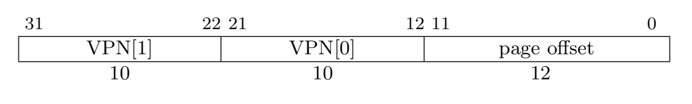

# 页表简介

> 本章代码对应分支：paging

## 概要

本章我们将介绍一种常见的内存管理方式：分页。页表是为了实现分页而创建的数据结构，直观来看，其功能就是将虚拟地址转换为物理地址。本章我们将学习：

1. 什么是虚拟地址
2. 什么是页表
3. RISC-V 32 的页表格式
4. 在内核中创建最简单的页表

## 了解虚拟地址

操作系统的一个主要任务是将程序彼此隔离。比如，你在浏览网页时，并不应该干扰你的文本编辑器。而在编写浏览器或文本编辑器的时候，必然会需要对内存进行操作。然而编写文本编辑器的人也许并不认识编写浏览器的人。所以他们并不知道对方需要使用那部分的内存。

让我们先来看一个例子：

```rust
fn main(){
    let a: i32 = 5;
    // &a 先转成 raw 指针，然后再把指针转成 usize，这样就可以显示地址了。
    let addr = &a as *const i32 as usize;
    println!("addr: 0x{:X}",addr);
}
```

编译运行上述代码，在我的电脑（64 位）中，输出的结果是 `0x7FFCA26C5734`，这里输出的地址叫做虚拟地址。在计算机真实访问内存的时候，并不会直接访问到变量的物理地址，而是先进行一个虚地址到物理地址的转换。可假想这个转换有一个函数，叫 `fn virtual2physical(usize address) -> usize` ，那么实际访问的内存则是： `virtual2physical(0x7FFCA26C5734)` 。

虚拟地址可能是不唯一的，但物理地址一定是唯一的。每一个线程可以拥有不同的虚实地址转换方法，所以 **不同的虚拟地址可以转换成同一个物理地址；相同的虚拟地址可以转换成不同的物理地址** 。

比如，这样，程序员在编写程序时，并不需要考虑内存冲突的问题，因为操作系统会给他分配一片“连续的虚拟内存”（即便他们的物理地址不一定连续）。

> 这段话看不懂没关系，以后学到了进程线程可能就懂了

## 页表简介

页表就是一个用于将虚拟地址转换为物理地址的工具。在 riscv32 中，如果 satp（Supervisor Address Translation and Protection，监管者地址转换和保护）寄存器的第 31 位为 1 ，则表示启用页表机制。在访问虚拟内存时（开启页表时只允许访问虚拟内存），内存管理单元 MMU(Memory Management Unit) 会用过页表将虚拟地址转换为物理地址，再进行访问，

分页技术的核心思想是将虚拟内存空间和物理内存空间视为固定大小的小块，虚拟内存空间的块称为 **页面（pages）** ，物理地址空间的块称为 **帧（frames）** ，每一个页都可以映射到一个帧上。

虚拟地址可以分为两部分， **VPN（virtual page number）** 和 **page offset** ：



虚拟地址的用法如下：

- 通过页表，将 VPN 转换为目标物理地址所处的页面
- 通过 page offset 在页面中找到具体的物理地址

riscv32 框架下，每个页面的大小为 4kb ，所以为了能够访问页面中的任意物理位置， page offset 的长度为 12 位。

> 2^12 byte = 4kb

## RISC-V 32 的页表格式

riscv32 框架采用了二级页表。一般来说，一个线程只有一个 **页目录** ，不同的线程有不同的 **页目录** （多个内核线程可以共用同一个页目录），所以对于不同的线程，相同的虚拟地址可以转换到不同的物理地址。页目录的每一项可能为空，也可能指向一个页表。

在 riscv32 中，物理地址是 34 位的：


虚拟地址是 32 位的，对于单个线程来说，其最多可使用的空间为 4G 。但是由于物理地址是 34 位的，所以整个系统可以包含多个线程，最大可用的内存为 16G 。

**riscv32 中所有页面都是 4k 对齐的！！！** 因此任何页表所在地址的低 12 位一定是 0 。这使得我们在保存页表的地址的时候只需要保存其高 22 位（PPN）。

**页目录** 也是一个页面，可以理解为长度为 1024 的 u32 数组。每个 u32 就是一个页目录项，指向下一个页面。

riscv32 中， **页表项/页目录项** 的结构是一样的，如下图所示：


### 虚实转换

页表中保存的地址均为物理地址，通过二级页表的地址虚实转换的过程如下：

- 通过页表，将 VPN 转换为目标物理地址所处的页面
  1. 通过 satp 获取页目录的基址(satp.PPN)。由于页目录的地址是 4k 对齐的，因此 `satp.PPN << 12`（也可以写为 `satp.PPN * PAGE_SIZE`）就是页目录的所在的物理地址。
  2. VPN[1] 给出了二级页号，因此处理器会读取位于地址 `satp.PPN * PAGE_SIZE + VPN[1] * PTE_SIZE` 的页目录项（page dir entry, pde）。
  3. 该 pde 包含一级页表的物理地址，VPN[0] 给出了一级页号，因此处理器读取位于地址 `pde.PPN * PAGE_SIZE + VPN[0] * PTE_SIZE` 的页表项（page table entry）。
- 通过 page offset 在页面中找到具体的物理地址
  pte 的 PPN 字段和页内偏移（原始虚拟地址的低 12 位）组成了最终的物理地址：`pte.PPN * PAGE_SIZE + page_offset` 。

> 在 riscv32 中，PAGE_SIZE = 4096，PTE_SIZE = sizeof(u32) = 4

该过程可由下图表示。本文使用页表项（PTE）和页目录项（PDE）来区分一级页表和二级页表项，但是实际上他们的结构是相同的，所以图中将二者均写为 PTE 。左边的 PTE 为页目录项，右边的 PTE 为页表项。


### 页标志位

我们再来看一次 riscv32 中 **页表项/页目录项** 的结构：


- 如果 X, W, R 位均为 0 ，则表示该项包含了下一级页表的物理地址（为页目录项）。
- 否则表示该项包含了页面的物理地址（一般为页表项）。

> RSW 域留给操作系统使用，它会被硬件（MMU）忽略，即虚实地址的转换与它无关，这里我们无需考虑

下面给出 XWR 位为不同值时表达的意思：

|  X  |  W  |  R  | Meaning                             |
| :-: | :-: | :-: | :---------------------------------- |
|  0  |  0  |  0  | Pointer to next level of page table |
|  0  |  0  |  1  | Read-only page                      |
|  0  |  1  |  0  | Reserved for future use             |
|  0  |  1  |  1  | Read-write page                     |
|  1  |  0  |  0  | Execute-only page                   |
|  1  |  0  |  1  | Read-execute page                   |
|  1  |  1  |  0  | Reserved for future use             |
|  1  |  1  |  1  | Read-write-execute page             |

riscv 中， satp 寄存器的低 22 位保存了 **页目录** 的物理地址（类似于 X86 的 CR3 寄存器）。

- **大页**
  一般来说，页目录项保存的是指向下一个页表的地址的 PPN 和页标识位，且 XWR 均为 0 。但是，如果此时 XWR 不为 0 ，则其指向的是一片大小为 `1024 * 4k = 4M` 的物理地址，也称为 **大页** 。后面我们映射内核的时候就使用大页的映射方式。

### 线性映射

我们可以通过 satp 寄存器获得页目录的物理地址。但是如果我们开启了页机制，就不能再直接访问到物理地址。此时一种最简单的解决方案是：**将全部物理内存区域映射到虚拟地址空间**。此时虚拟地址和物理地址之间会有一种简单的对应关系，称为 **线性映射** ，具体关系式如下：

```
virtual address = physical address + offset
```

## 分页机制的实现

### 建立最简单的页表并开启分页

OpenSBI 并没有开启页机制，因此当我们 kernel 的第一条指令被执行的时候，是工作在物理地址上的。而当我们进入 Rust 代码后，运行栈上就已经保存了一些指针信息，此时再改变内核地址就会破坏运行时上下文。因此我们将切换地址空间的工作放在刚进入内核 S 态的汇编代码中完成。

为了方便起见，我们采用大页的映射方式，一次映射 4M 的空间。OpenSBI 将它自己放在 0x80000000 的位置，boot 结束后会跳转到 0x80400000（即我们编写的 os 的位置）。因此我们只需要映射 OpenSBI 所在的地址和我们的 os 所在的地址。

> 实际上 OpenSBI 是不需要映射的，因为 S 态不需要也不能访问 OpenSBI 的内存了。这里为了练习页表的使用也将其一起映射，在文章结尾处我们会代码，不再映射 OpenSBI ，并进行一些别的改动

首先修改 `boot/entry.asm` ，在其中定义第一个页表的内容：

```nasm
    .section .data    # 放在 data 段中，之后会修改内容
    .align 12         # 4K 页对齐
boot_page_table_sv32:
    .zero 4 * 512
    # 0x80000000 -> 0x80000000 (4M * 2)
    .word (0x80000 << 10) | 0xcf # VRWXAD
    .word (0x80400 << 10) | 0xcf # VRWXAD
    .zero 4 * 510
```

这个最简单的页表只包含一个页目录，占用 4K 空间。在其中我们对需要用到的地址空间建立 **对等映射** ，即 `虚拟地址 = 物理地址` 。具体而言，这个页目录包含 1024 个页目录项，每一项对应 4M 大小的地址空间（全是大页）。

接下来我们计算建立对等映射时，应该修改哪一项页目录项：

```
pageTableIndex(0x80000000) = 0x80000000.PPN[1] = 0x200 = 512
pageTableIndex(0x80400000) = 0x80400000.PPN[1] = 0x201 = 513
```

于是我们得出，需要映射的页目录项的下标为 512 和 513 ，他们分别对应 OpenSBI 和内核所在的物理地址空间：

| 区域    | 地址空间                   | PDX |
| ------- | -------------------------- | --- |
| OpenSBI | 0x80000000-0x80400000 (4M) | 512 |
| 内核    | 0x80400000-0x80800000 (4M) | 513 |

接下来我们看填入页表项的内容。（参考上面对页表项格式的定义）由于是对等映射，PPN 就是 0x80000 和 0x80400 。标志位我们填入 VRWXAD（0xcf），即映射到可读写可执行的大页。

```nasm
.word (0x80000 << 10) | 0xcf # VRWXAD
.word (0x80400 << 10) | 0xcf # VRWXAD
```

其它项由于没有映射，直接填 0 即可。

在我们开启分页之前，先看一下管理分页的寄存器 satp 的结构：


> ASID(Address Space Identifier，地址空间标识符)域是可选的，它可以用来降低上下文切换的开销，这里我们直接填 0

这需要在 satp 寄存器中填入页目录的物理地址的 PPN ，并将最高位置为 1 ：

```nasm
_start:
    # 1. enable paging
    # satp = (1 << 31) | PPN(boot_page_table_sv32)
    lui     t0, %hi(boot_page_table_sv32)
    srli    t0, t0, 12
    li      t1, 1 << 31
    or      t0, t0, t1
    csrw    satp, t0
    sfence.vma  # flush tlb
```

`lui t0, %hi(boot_page_table_sv32)` 将 `boot_page_table_sv32` 的高 20 位复制到 t0 的高 20 位，t0 的第 12 位填 0 。右移 12 位后就正确的给 PPN 部分赋值了。

> MPIS 与 RISCV 语法不同，`%hi` 的作用是取高 16 位

这时运行会出现 `panicked at 'unexpected trap'` ，这是由于在上一章我们“凭感觉”定了一个 `KERNEL_HEAP_SIZE: usize = 0x00a0_0000` ，这一部分是被算入内核大小的。而在映射的时候，我们只映射了 4M 的内核地址，所以这个数字也需要相应进行修改，否则其余内核部分未被映射会导致内存访问错误。我们将其改小为 `0x0010_0000` 。

编译运行，应该能看到和之前相同的运行效果。

### 将内核移动到高地址空间

有了页表，我们就能改变内核运行时的虚拟地址了。传统的 Linux 操作系统中，在不使用 PTI（内核页表隔离）特性的情况下，内核和用户程序处于同一个地址空间（即使用同一个页表）。内核位于高地址空间，用户程序使用低地址空间。在 32 位系统中，这个界限一般是 0xC0000000，即内核使用最上面 1G 的空间，用户程序可用下面 3G 的空间。

接下来我们将内核的起始地址移动到 0xC0400000，即建立偏移为 `0xC0400000 - 0x80400000 = 0x40000000` 的线性映射。

在修改汇编代码之前，我们首先修改链接脚本 `linker.ld` ：

```diff
- BASE_ADDRESS = 0x80400000;
+ BASE_ADDRESS = 0xC0400000;
```

由于修改了基址，相应的我们在计算可使用内存的时候用到的 `end` 也需要转换为物理地址：

- `consts.rs`

```diff
+ pub const KERNEL_OFFSET: usize = 0xC000_0000;
```

- `memory/mod.rs`

```diff
- let memory_start = (end as usize) + PAGE_SIZE;
+ let memory_start = (end as usize - KERNEL_OFFSET + MEMORY_OFFSET) + PAGE_SIZE;
```

这样再次链接后的所有符号都移动到了新的地址上。注意 `boot_page_table_sv32` 是个符号，使用虚地址。而 satp 中需要填入物理地址。因此需要减去一个偏移。因此，我们还需要修改一下加载页目录地址的代码：

```diff
    # 1.1 enable paging
    # satp = (1 << 31) | PPN(boot_page_table_sv32)
    lui     t0, %hi(boot_page_table_sv32)
+   li      t1, 0xC0000000 - 0x80000000
+   sub     t0, t0, t1
    srli    t0, t0, 12
    li      t1, 1 << 31
    or      t0, t0, t1
    csrw    satp, t0
    sfence.vma
```

接下来修改一下页目录。首先，OpenSBI 所在内存不再需要被映射，然后将 0xC0400000 内存映射到 0x80400000 。注意，这里保留了 0x80400000 内存映射到 0x80400000 的对等映射：

```nasm
    .section .data
    .align 12
boot_page_table_sv32:
    .zero 4 * 513
    # 0x80400000 -> 0x80400000 (4M)
    .word (0x80400 << 10) | 0xcf # VRWXAD
    .zero 4 * 255
    # 0xC0400000 -> 0x80400000 (4M)
    .word (0x80400 << 10) | 0xcf # VRWXAD
    .zero 4 * 254
boot_page_table_sv32_top:
```

> `pageTableIndex(0xC0400000) = 0xC0400000.PPN[1] = 0x301 = 769 = 513 + 1 + 255`

之所以还要保留 0x80400000 的对等映射，是因为在开启分页的一瞬间，PC 仍然指向物理地址。如果撤掉了对等映射，那么在设置 satp 的下一条指令会立即触发缺页异常。我们需要一段同时存在两种映射的过渡期来切换 PC ，之后就可以取消这个对等映射。具体代码如下：

```nasm
    # 1.2 update PC to 0xCxxxxxxx
    lui     t0, %hi(remove_identity_map)
    addi    t0, t0, %lo(remove_identity_map)
    jr      t0
    # 1.3 remove identity map
remove_identity_map:
    lui     t0, %hi(boot_page_table_sv32_top)
    sw      zero, (-4 * 511)(t0)
    sfence.vma
```

我们使用绝对跳转指令来切换 PC ：首先定义一个符号 `remove_identity_map`，然后将其虚地址加载到寄存器 `t0` ，最后使用 `jr` 指令跳转到 `t0` 指向的地址。

> 思考：为什么需要使用 `boot_page_table_sv32_top` 而非 `boot_page_table_sv32` 访问页目录？
>
> 提示：立即数偏移范围是 [-2048, 2047]

现在 PC 已经指向位于 0xC0000000 区域的虚拟地址空间，就可以撤销对等映射了：我们向下标为 513 的页表项地址处写入 0，然后执行 `sfence.vma` 刷新 TLB。

再次编译运行，应该可以正常进入 Rust 代码。此时如果打印一个指针，就可以看到它们的地址已经变成了 0xC04xxxxx 。

### 处理缺页异常

当开启页机制后，如果程序访问没有映射的虚拟地址，或者访问权限不正确，就会触发缺页异常（Page Fault）。

我们之前已经建立好了中断处理函数 `rust_trap`，可以直接在其中进行处理。首先新建一个处理缺页的函数，输出原因和错误地址：

```rust
fn page_fault(tf: &mut TrapFrame) {
    println!("{:?} @ {:#x}", tf.scause.cause(), tf.stval);
    panic!("page fault");
}
```

然后在 `rust_trap` 中检查异常类型并转发到此函数：

```rust
#[no_mangle]
pub extern "C" fn rust_trap(tf: &mut TrapFrame) {
    match tf.scause.cause() {
        Trap::Exception(Exception::Breakpoint) => breakpoint(),
        Trap::Interrupt(Interrupt::SupervisorTimer) => timer(),
        Trap::Exception(Exception::InstructionPageFault) => page_fault(tf),
        Trap::Exception(Exception::LoadPageFault) => page_fault(tf),
        Trap::Exception(Exception::StorePageFault) => page_fault(tf),
        _ => panic!("unexpected trap: {:#x?}", tf),
    }
}
```

接着我们在主函数中进行测试：

- 读取一下内核的第一条指令
- 访问一个没有映射的非法地址

```rust
fn test_page_table() {
    // test read
    let ptr = 0xc0400000 as *const u32;
    let value = unsafe { ptr.read() };
    println!("addr: {:?}, value: {:#x}", ptr, value);

    // test write: page fault!
    unsafe {
        (0xc0000000 as *mut u32).write(0);
    }
}
```

编译运行，结果如下所示：

```
addr: 0xc0400000, value: 0xc040c2b7
Exception(StorePageFault) @ 0xc0000000
panicked at 'page fault', src/interrupt.rs:49:5
```

我们用 `make asm` 查看一下内核的反汇编：

```
Disassembly of section .text:

c0400000 <_start>:
c0400000:       c040c2b7                lui     t0,0xc040c
c0400004:       40000337                lui     t1,0x40000
c0400008:       406282b3                sub     t0,t0,t1
...
```

可以看到程序读取到的第一条指令是正确的。并且之后正确触发了缺页异常。

## 预告

现在我们已经有了一个可使用的页表了，但是它的功能还十分有限。后续我们将实现功能更加强大的页表。但是目前它已经够用了。下一章我们将创建内核线程。
